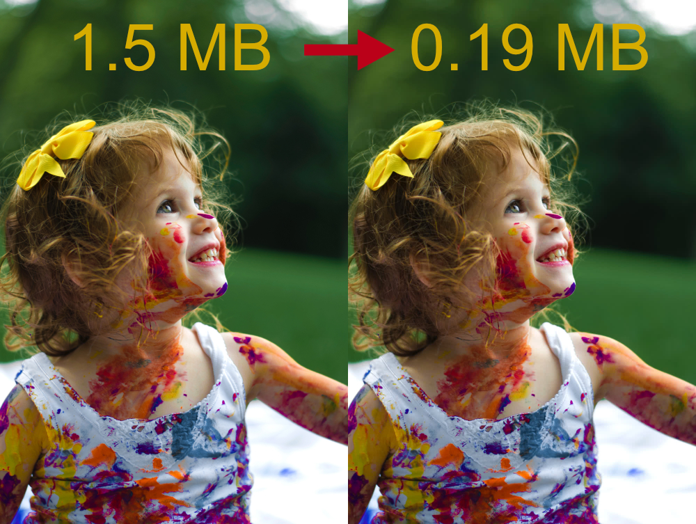

Guetzli is a Google program to optimize JPEG images. Unfortunately, it only works one file at a time. With this script in Python you can do it recursively a whole folder.

## Image optimized with **guetzli-recursively**



Image Author: [Senjuti Kundu](https://unsplash.com/@senjuti?utm_medium=referral&amp;utm_campaign=photographer-credit&amp;utm_content=creditBadge)

# Install 

Guetzli must be installed on your system. Follow the official instructions.
[Guetzli](https://github.com/google/guetzli)

and 2.7.10 or Python 3.

After

```bash
pip3 install guetzli-recursively
```

# Use

```bash
guetzli_recursively [folder]
```

## Example

```bash
guetzli_recursively img/
```

out

```bash
img/tasks.jpg
Save 6%
img/portfolio/idecrea/space.jpg
It is not necessary to optimize
img/portfolio/home.jpg
Save 3%
```

# Quality

Must be greater than or equal to 84.

```bash
guetzli_recursively --quality 85 img/
```

# Mem limit (bytes)

```bash
guetzli_recursively --memlimit 28000 img/
```

# GUIs

- [Mac OS](https://github.com/tanrax/guetzli-recursively-gui)
